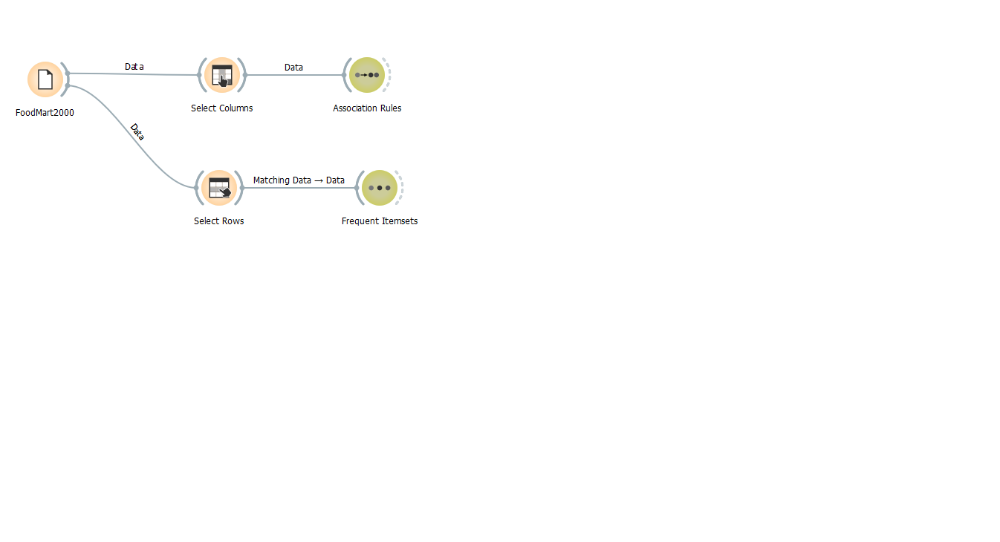
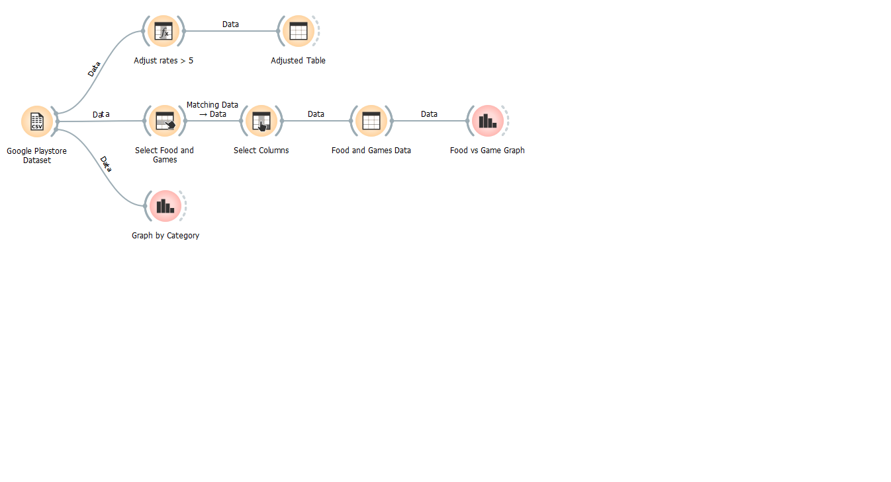
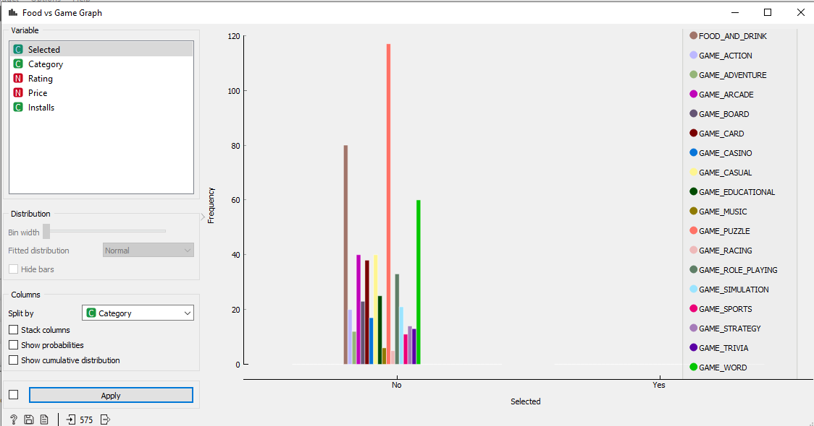
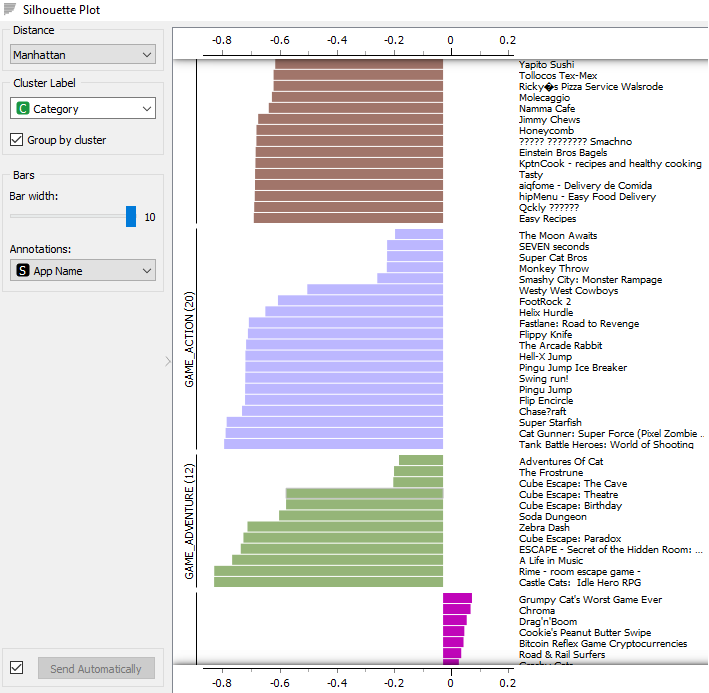

## Tarefa: Regras de Associação Foodmart

Acesse o diretório [Foodmart](https://github.com/santanche/component2learn/tree/master/labs/01-data-flow/orange/foodmart), que relaciona compras realizadas por clientes sobre produtos, e descubra regras de associação entre produtos. Como estes
dados poderiam ser explorados para recomendar produtos para clientes?

* Imagem do projeto Foodmart:

* Link do arquivo do projeto Foodmart:
  * [Foodmart Association](https://github.com/ronagalvao/Laboratorios/tree/master/Lab01/orange/)

## Tarefa: Google Play Store

Acesse o diretório [Google Play Store](https://github.com/santanche/component2learn/tree/master/labs/01-data-flow/orange/google-playstore) e elabore algum projeto que apresente algum gráfico que permita uma análise interessante dos dados.

* Imagem do projeto Google PlayStore:

* Graficos do projeto Google PlayStore:

---

* Link do arquivo do projeto Google PlayStore:
  * [Google PlayStore Preparation ](https://github.com/ronagalvao/Laboratorios/tree/master/Lab01/orange/)

## Tarefa: Projeto de Composição para Recomendação

Elabore um diagrama compondo componentes que seja capaz de executar o seguinte cenário:
1. O cliente escolhe um produto para compra.
2. O sistema encontra os produtos mais prováveis para recomendar, baseado em regras de associação.
3. O sistema recomenda (ranqueados) três outros produtos para o cliente.

Nesta tarefa, basta o diagrama de componentes, não é necessário detalhar as interfaces.

* Imagem do diagrama de componente:

---
## Tarefa: Projeto de Composição de Pedido

Elabore um diagrama de composição de componentes que execute o fluxo de execução que vai desde o pedido de um produto até a sua entrega para o cliente.

Nesta tarefa, você deve detalhar as interfaces em um diagrama UML a parte.
