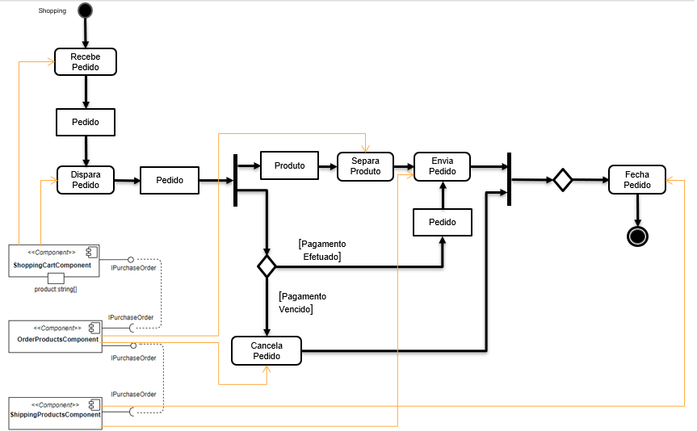

# Orquestração e Coreografia
*Lab de Componentização e Reúso de Software 15/08/2020*

## Tarefa 1

Considere a `Tarefa Projeto de Composição de Pedido`, que foi realizada no [Laboratório 1](../01-data-flow):

> Elabore um diagrama de composição de componentes que execute o fluxo de execução que vai desde o pedido de um produto até a sua entrega para o cliente.

Represente esse processo na forma de um diagrama de atividades e ligue etapas desse diagrama com os componentes (do seu diagrama original) que executam as ações (Actions). Nesse processo, você pode enriquecer o fluxo da atividade, já que o diagrama te oferece primitivas de decisão e paralelização, bem como modificar os componentes que você projetou originalmente.

## Tarefa 2

Usando a representação de componentes que se comunicam por mensagens na forma de uma orquestração, elabore um diagrama contendo os componentes (Blackbox) e as respectivas interfaces de eventos para realizar um **leilão virtual invertido de produtos**, conforme a seguinte sequência:
1. o cliente seleciona um produto;
2. um módulo de leilão informa a todos os potenciais fornecedores daquele produto sobre a demanda e inicia um leilão;
3. os potenciais fornecedores fazem ofertas;
4. Os três produtos com menor preço são apresentados para o cliente - em caso de empate de preço, considerar quem fez primeiro a oferta.

## Tarefa 3

Elabore um protótipo de uma interface gráfica com um usuário no MIT App Inventor que simule uma interface de compra, com as seguintes funcionalidades:
1. apresente uma interface com as seguintes áreas:
  * uma lista opções com o nome de três produtos (a sua escolha);
  * um quadro de detalhes do produto;
  * um campo para o usuário digitar a quantidade que deseja comprar;
  * um botão de efetivação da compra;
  * um campo de mensagens no rodapé.
2. ao clicar no produto da lista de opções, deve ser apresentado no quadro de detalhamento:
  * a imagem do produto;
  * seu nome;
  * o valor unitário e a unidade (g, kg, l);
3. quando o botão de efetivação da compra for clicado, deve ser mostrado no campo de mensagem (rodapé) os dados da compra sendo efetivada: nome do produto, quantidade e o valor total a ser pago.

## Tarefa 4

Tarefa a ser feita com a equipe do trabalho:
Usando o espaço que separa o MVC, detalhe os diagramas das Tarefas 1 e 2, da seguinte maneira:
* considere que os diagramas que você fez fazem parte do Controller;
* detalhe mais componentes referentes ao Model e ao View;
* defina como será a interação entre esses componentes.
