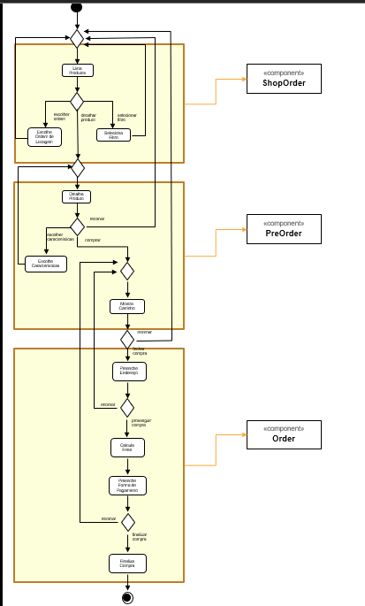
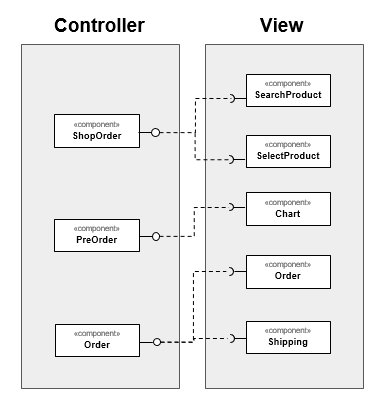
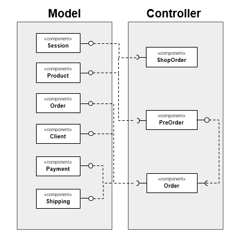

# Serviços
*Lab de Componentização e Reúso de Software 22/08/2020*

No link do Google Drive [modelo](https://docs.google.com/presentation/d/1ujoME3qoriVm7hHiC8uK2qWQ3mmHA81Qxe8n80vZYms/edit?usp=sharing) ou no diretório [resources/](resources/) você encontrará um modelo para resolver duas tarefas:

Para as Tarefas 1, 2 e 3 que estão listadas dentro dos slides:

## Tarefa 1 - Componentes de Negócio

* Delimite partes do diagrama à esquerda que você avalia que deveriam estar dentro de um componente.

## Tarefa 2 - Componentes Técnicos View/Controller

* Separe os componentes do View daqueles definidos no Controller.

## Tarefa 3 - Componentes Técnicos Model/Controller

* Separe os componentes do Model daqueles definidos no Controller.

## Tarefa 4

Encontre dois serviços REST interessantes, que recebam no mínimo dois parâmetros e execute pelo menos uma consulta em cada um deles. Apresente para cada serviço que você escolheu:

* **Título do serviço**: `OMDb - The Open Movie Database`
* **Breve descrição**:
  É um serviço onde é possivel obter informações sobre filmes e series que foram ou serão lançados
* **URL completa da requisição**: `http://www.omdbapi.com/?t=Batman&y=2021`
* **Cabeçalho HTTP da chamada**:
~~~http
GET http://www.omdbapi.com/?t=Batman&y=2021
Accept: text/plain, */*; q=0.01
Accept-Encoding: gzip, deflate
Accept-Language: pt-BR,pt;q=0.9
Connection: keep-alive
Cookie: __cfduid=da4a5d49ff73069651aa543ae06b4d11b1598489641; _ga=GA1.2.1231188162.1598489495; _gid=GA1.2.1972815141.1598489495
Host: www.omdbapi.com
Referer: http://www.omdbapi.com/
User-Agent: Mozilla/5.0 (Windows NT 10.0; Win64; x64) AppleWebKit/537.36 (KHTML, like Gecko) Chrome/84.0.4147.135 Safari/537.36
X-Requested-With: XMLHttpRequest
~~~
* **Cabeçalho HTTP da resposta**:
~~~http
Access-Control-Allow-Origin: *
Cache-Control: public, max-age=86400
CF-Cache-Status: MISS
CF-RAY: 5c91dce28a1c09c8-GIG
cf-request-id: 04cf086191000009c86898e200000001
Connection: keep-alive
Content-Encoding: gzip
Content-Type: application/json; charset=utf-8
Date: Thu, 27 Aug 2020 01:01:42 GMT
Expires: Thu, 27 Aug 2020 02:01:42 GMT
Last-Modified: Thu, 27 Aug 2020 01:01:42 GMT
Server: cloudflare
Transfer-Encoding: chunked
Vary: *, Accept-Encoding
X-AspNet-Version: 4.0.30319
X-Powered-By: ASP.NET
~~~
* **Conteúdo da resposta**:
~~~json
{
"Title":"The Batman",
"Year":"2021",
"Rated":"N/A",
"Released":"01 Oct 2021",
"Runtime":"N/A",
"Genre":"Action, Crime, Drama",
"Director":"Matt Reeves",
"Writer":"Bill Finger (Batman created by), Bob Kane (Batman created by), Matt Reeves (screenplay), Mattson Tomlin (screenplay)",
"Actors":"Colin Farrell, Robert Pattinson, Zoë Kravitz, Paul Dano",
"Plot":"The plot is unknown.",
"Language":"English",
"Country":"USA",
"Awards":"N/A",
"Poster":"https://m.media-amazon.com/images/M/MV5BZjE4MTdhNGYtMjA1My00ODU1LTg0NzQtZDdiMmY0Y2E4NzY1XkEyXkFqcGdeQXVyMTkxNjUyNQ@@._V1_SX300.jpg","Ratings":[],
"Metascore":"N/A",
"imdbRating":"N/A",
"imdbVotes":"N/A",
"imdbID":"tt1877830",
"Type":"movie",
"DVD":"N/A",
"BoxOffice":"N/A",
"Production":"N/A",
"Website":"N/A",
"Response":"True"
}
~~~

* **Título do serviço**: `Spotfy - API Console`
* **Breve descrição**:
Com base em princípios REST simples, os terminais da API da Web do Spotify retornam metadados JSON sobre artistas, álbuns e faixas, diretamente do Catálogo de Dados Spotify.
* **URL completa da requisição**: `https://any-api.com:8443/https://api.spotify.com/v1/search?limit=1&offset=0&q=Stevie%20Ray%20Vaughan&type=artist`
* **Cabeçalho HTTP da chamada**:
~~~http
GET https://any-api.com:8443/https://api.spotify.com/v1/search?limit=1&offset=0&q=Stevie%20Ray%20Vaughan&type=artist
access-control-allow-credentials: true
access-control-allow-headers: Accept, App-Platform, Authorization, Content-Type, Origin, Retry-After, Spotify-App-Version, X-Cloud-Trace-Context
access-control-allow-methods: GET, POST, OPTIONS, PUT, DELETE, PATCH
access-control-allow-origin: *
access-control-max-age: 604800
cache-control: public, max-age=7200
content-encoding: br
content-type: application/json; charset=utf-8
date: Thu, 27 Aug 2020 23:53:08 GMT
server: cloudflare
via: HTTP/2 edgeproxy, 1.1 google
x-content-type-options: nosniff
x-final-url: https://api.spotify.com/v1/search?limit=1&offset=0&q=Stevie%20Ray%20Vaughan&type=artist
x-robots-tag: noindex, nofollow
~~~
* **Cabeçalho HTTP da resposta**:
~~~http
access-control-allow-credentials: true
access-control-allow-headers: Accept, App-Platform, Authorization, Content-Type, Origin, Retry-After, Spotify-App-Version, X-Cloud-Trace-Context
access-control-allow-methods: GET, POST, OPTIONS, PUT, DELETE, PATCH
access-control-allow-origin: *
access-control-expose-headers: content-type,cache-control,x-robots-tag,access-control-allow-origin,access-control-allow-headers,access-control-allow-methods,access-control-allow-credentials,access-control-max-age,content-encoding,strict-transport-security,x-content-type-options,date,server,via,alt-svc,connection,transfer-encoding,x-final-url
access-control-max-age: 604800
cache-control: public, max-age=7200
cf-cache-status: DYNAMIC
cf-ray: 5c99b5d4ab29f857-GIG
cf-request-id: 04d3eff8e50000f857b5805200000001
content-encoding: br
content-type: application/json; charset=utf-8
date: Thu, 27 Aug 2020 23:53:08 GMT
expect-ct: max-age=604800, report-uri="https://report-uri.cloudflare.com/cdn-cgi/beacon/expect-ct"
server: cloudflare
status: 200
via: HTTP/2 edgeproxy, 1.1 google
x-content-type-options: nosniff
x-final-url: https://api.spotify.com/v1/search?limit=1&offset=0&q=Stevie%20Ray%20Vaughan&type=artist
x-request-url: https://api.spotify.com/v1/search?limit=1&offset=0&q=Stevie%20Ray%20Vaughan&type=artist
x-robots-tag: noindex, nofollow
~~~
* **Conteúdo da resposta**:
~~~json
{
  "artists": {
    "href": "https://api.spotify.com/v1/search?query=Stevie+Ray+Vaughan&type=artist&offset=0&limit=1",
    "items": [
      {
        "external_urls": {
          "spotify": "https://open.spotify.com/artist/5fsDcuclIe8ZiBD5P787K1"
        },
        "followers": {
          "href": null,
          "total": 1615598
        },
        "genres": [
          "blues",
          "blues rock",
          "classic rock",
          "electric blues",
          "instrumental rock",
          "modern blues",
          "rock",
          "texas blues"
        ],
        "href": "https://api.spotify.com/v1/artists/5fsDcuclIe8ZiBD5P787K1",
        "id": "5fsDcuclIe8ZiBD5P787K1",
        "images": [
          {
            "height": 1021,
            "url": "https://i.scdn.co/image/1de60c936683320769a1bfb6fba7f75902859085",
            "width": 1000
          },
          {
            "height": 654,
            "url": "https://i.scdn.co/image/5bd95fbc961256c56560d838bd74d05be50701d4",
            "width": 640
          },
          {
            "height": 204,
            "url": "https://i.scdn.co/image/a812f6770a18e269934733f69fba0daf93f3ae04",
            "width": 200
          },
          {
            "height": 65,
            "url": "https://i.scdn.co/image/81bae876781fef5f3092c27a39f3b188f64bb98c",
            "width": 64
          }
        ],
        "name": "Stevie Ray Vaughan",
        "popularity": 66,
        "type": "artist",
        "uri": "spotify:artist:5fsDcuclIe8ZiBD5P787K1"
      }
    ],
    "limit": 1,
    "next": "https://api.spotify.com/v1/search?query=Stevie+Ray+Vaughan&type=artist&offset=1&limit=1",
    "offset": 0,
    "previous": null,
    "total": 4
  }
}
~~~
