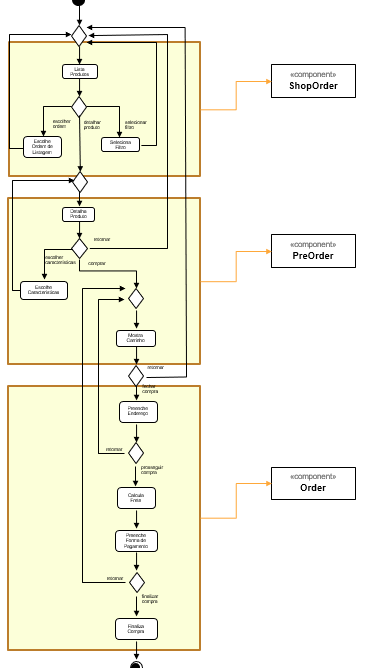

# Serviços
*Lab de Componentização e Reúso de Software 22/08/2020*

No link do Google Drive [modelo](https://docs.google.com/presentation/d/1ujoME3qoriVm7hHiC8uK2qWQ3mmHA81Qxe8n80vZYms/edit?usp=sharing) ou no diretório [resources/](resources/) você encontrará um modelo para resolver duas tarefas:

Para as Tarefas 1, 2 e 3 que estão listadas dentro dos slides:

## Tarefa 1 - Componentes de Negócio

* Delimite partes do diagrama à esquerda que você avalia que deveriam estar dentro de um componente.

## Tarefa 2 - Componentes Técnicos View/Controller

* Separe os componentes do View daqueles definidos no Controller.

## Tarefa 3 - Componentes Técnicos Model/Controller

* Separe os componentes do Model daqueles definidos no Controller.

## Tarefa 4

Encontre dois serviços REST interessantes, que recebam no mínimo dois parâmetros e execute pelo menos uma consulta em cada um deles. Apresente para cada serviço que você escolheu:

* **Título do serviço**: `The Open Movie Database`
* **Breve descrição**:
  É um serviço onde é possivel obter informações sobre filmes e series
* **URL completa da requisição**: `http://www.omdbapi.com/?t=Batman&y=2021`
* **Cabeçalho HTTP da chamada**:
~~~http
GET http://www.omdbapi.com/?t=Batman&y=2021
Accept: text/plain, */*; q=0.01
Accept-Encoding: gzip, deflate
Accept-Language: pt-BR,pt;q=0.9
Connection: keep-alive
Cookie: __cfduid=da4a5d49ff73069651aa543ae06b4d11b1598489641; _ga=GA1.2.1231188162.1598489495; _gid=GA1.2.1972815141.1598489495
Host: www.omdbapi.com
Referer: http://www.omdbapi.com/
User-Agent: Mozilla/5.0 (Windows NT 10.0; Win64; x64) AppleWebKit/537.36 (KHTML, like Gecko) Chrome/84.0.4147.135 Safari/537.36
X-Requested-With: XMLHttpRequest
~~~
* **Cabeçalho HTTP da resposta**:
~~~http
Access-Control-Allow-Origin: *
Cache-Control: public, max-age=86400
CF-Cache-Status: MISS
CF-RAY: 5c91dce28a1c09c8-GIG
cf-request-id: 04cf086191000009c86898e200000001
Connection: keep-alive
Content-Encoding: gzip
Content-Type: application/json; charset=utf-8
Date: Thu, 27 Aug 2020 01:01:42 GMT
Expires: Thu, 27 Aug 2020 02:01:42 GMT
Last-Modified: Thu, 27 Aug 2020 01:01:42 GMT
Server: cloudflare
Transfer-Encoding: chunked
Vary: *, Accept-Encoding
X-AspNet-Version: 4.0.30319
X-Powered-By: ASP.NET
~~~
* **Conteúdo da resposta**:
~~~json
{
"Title":"The Batman",
"Year":"2021",
"Rated":"N/A",
"Released":"01 Oct 2021",
"Runtime":"N/A",
"Genre":"Action, Crime, Drama",
"Director":"Matt Reeves",
"Writer":"Bill Finger (Batman created by), Bob Kane (Batman created by), Matt Reeves (screenplay), Mattson Tomlin (screenplay)",
"Actors":"Colin Farrell, Robert Pattinson, Zoë Kravitz, Paul Dano",
"Plot":"The plot is unknown.",
"Language":"English",
"Country":"USA",
"Awards":"N/A",
"Poster":"https://m.media-amazon.com/images/M/MV5BZjE4MTdhNGYtMjA1My00ODU1LTg0NzQtZDdiMmY0Y2E4NzY1XkEyXkFqcGdeQXVyMTkxNjUyNQ@@._V1_SX300.jpg","Ratings":[],
"Metascore":"N/A",
"imdbRating":"N/A",
"imdbVotes":"N/A",
"imdbID":"tt1877830",
"Type":"movie",
"DVD":"N/A",
"BoxOffice":"N/A",
"Production":"N/A",
"Website":"N/A",
"Response":"True"
}
~~~
